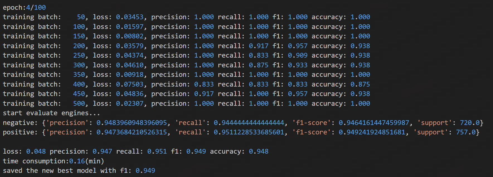
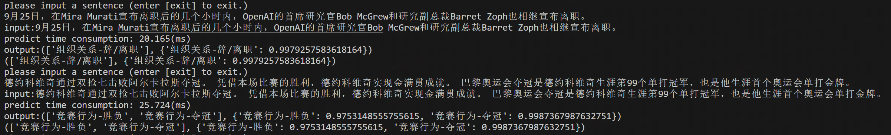
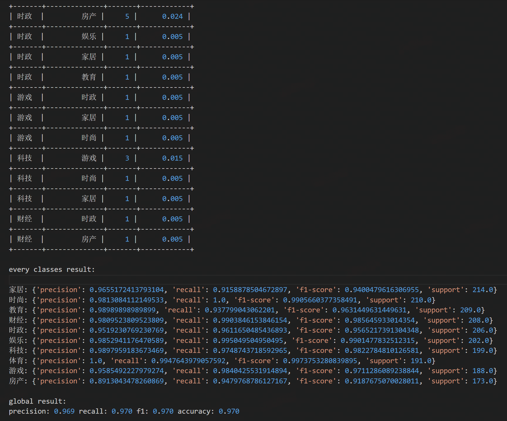

 [**English**](README.md) | [**中文说明**](README_ZH.md)

<p align="center">
    <br>
    
    <br>
</p>

<p align="center">
    <strong><span style="font-size: 50px;">Text Classification By Torch</span></strong>
</p>

<p align="center">
    <a>
        
    </a>
    <a>
        
    </a>    
    <a>
        
    </a>    
    <a>
        
    </a>
</p>


## Introduction
This repository is built for text classification tasks based on Torch, incorporating various training tricks, acceleration methods, distillation, compression, and pruning techniques. It supports both single-label and multi-label training. More detailed and customizable training configurations can be explored and adjusted in the `config.py` file.

While text classification problems can be effectively addressed by Large Language Models (LLMs) in the LLM era, traditional classification models are still needed in specific scenarios, such as high-concurrency services or low-resource devices. This project implements most of the classification training techniques used before the LLM era. Additionally, it organizes relevant models and training-related techniques along with their corresponding research papers at the end of the documentation, providing users with a convenient reference.  

## Updates 
日期| 版本     |描述
:---|:-------|---
2023-12-01| v5.4.0 |Added support for multi-label text classification and introduced a multi-label classification loss function.
2023-05-31| v5.3.0 |Modified the data post-processing logic to occur after each training batch.
2022-12-12| v5.2.0 |Integrated **TextPruner** to add model pruning methods, including pruning of vocabularies and intermediate Transformer layers.
2022-11-10| v5.1.1 |Added key adversarial training methods: **FreeLB** and **AWP**; refactored adversarial utility classes and introduced the **NoisyTune** method.
2022-10-21| v5.0.0 |Integrated **TextBrewer** distillation toolkit into the framework, added self-distillation support, and enabled distillation for smaller pre-trained models.
2022-09-23| v4.0.2 |Added **EMA (Exponential Moving Average)** for model smoothing.
2022-09-01| v4.0.1 |Enabled distillation of **K-fold** models into a single model.
2022-08-31| v4.0.0 |Introduced **K-folds** to better utilize validation datasets; merged distillation training into the train logic and unified loss function management.
2022-06-14| v3.9.2 |Added support for the **DeBERTaV3** model.
2022-05-23| v3.9.0 |Added **label smoothing** to mitigate inconsistencies caused by different annotators.
2022-04-24| v3.6.0 |Introduced **multisample dropout**.
2022-04-21| v3.5.0 |Added **SWA (Stochastic Weight Averaging)** for training
2022-03-31| v3.4.0 |Added **FastText**, **TextRCNN**, **MiniLM** models, configurable optimizers, and probability outputs.
2022-03-15| v3.3.0 |Integrated **Transformer**, **XLNet**, **ALBert**, **RoBerta**, and **Electra** models.
2022-03-03| v3.1.0 |Introduced **Warmup** for training, options for initializing non-finetuned model parameters, and support for **fp16 mixed precision training**.
2021-12-20| v3.0.0 |Added various training tricks: **R-Drop**, **FGM**, **PGD**, and **Focal Loss**.
2021-12-20| v2.2.0 |Provided methods to convert Torch models to **ONNX** format.
2021-09-23| v2.1.0 |Automatically generates validation datasets if not provided; added test dataset evaluation; enabled configurable pre-trained models.
2021-08-27| v2.0.0 |Provided two different distillation methods with detailed references to research papers.
2021-08-10| v1.0.0 |Initial release of the repository.

## Requirement  
Key environments: 
* python：3.10+  
* torch：2.4.1+ 
* Additional dependencies: see `requirements.txt`

## Usage  
The project supports multiple modes as follows: 

Mode               |       Detail                    | 
:------------------|---------------------------------|
train_classifier   | Train a classification model    |
interactive_predict| Interactive prediction mode     |
test               | Evaluate on a test dataset      |
convert_onnx       | Save Torch model as ONNX file   |
show_model_info    | Print model parameters          |

It also supports methods for training or distilling and pruning models: 

Mode               |       Detail                       | 
:------------------|------------------------------------|
finetune           | Fine-tune a pre-trained model      |
train_small_model  | Train a small model independently  |
distillation       | Model distillation                 |
prune              | Model pruning                      |

Supported Models: 

Type               |       Detail                                                                          | 
:------------------|---------------------------------------------------------------------------------------|
Pretrained Models  | Bert、DistilBert、RoBerta、ALBert、XLNet、Electra、MiniLM、DeBertaV3、XLM-RoBERTa      |
Traditional Models | FastText、TextCNN、TextRNN、TextRCNN、Transformer                                      |

Models are configured in `config.py`, with `f_model_type` specifying pre-trained models and `s_model_type` for small models. Use the `stage` parameter to perform operations on specific models.  

### Train  
hree sample datasets are provided for quick start:     
DataSet            |       Task                                       | 
:------------------|--------------------------------------------------|
example1           | Binary classification (Sentiment analysis)       |
example2           | Multi-class classification (News categorization) |
example3           | Multi-label classification                       |  

Replace the `config.py` file in the dataset directory with the project's `config.py` and run `main.py` to start training. Intermediate validation results will be displayed during training. Incremental training is supported.  
  

### Distill  
The project provides various distillation methods to train student models while preserving classification performance. Configure distillation parameters in `distill_configure` within `config.py`.

* Cross-Model Distillation

 
Use `example_datasets2/config.py` for a simple configuration that distills a trained Bert model into a TextCNN model. Modify the stage as follows and run main.py to start distillation:
```
stage = 'distillation'
```  
The distilled model also supports testing on the test dataset (set `mode = 'test'`) and making predictions (set `mode = 'interactive_predict'`).  


* Self-Distillation

  

Self-distillation of pre-trained models can reduce the number of Transformer blocks in the model. For example, a 12-layer BERT-Base model can be distilled into a model with only 3 Transformer blocks. This distillation logic is implemented by integrating [TextBrewer](https://github.com/airaria/TextBrewer). Continue using the `config.py` file under the `example_datasets2` directory. Modify the `stage` to `distillation` and update the `distill_configure` with the following configuration. Then, run `main.py` to start the distillation process.

```
distill_configure = {
    'self_distillation': True,
    'distillation_method': 'mse',
    'teacher_model_type': 'Bert',
    'student_model_type': 'Bert',
    'checkpoints_dir': 'checkpoints/example2_distillation_1',
    'epoch': 100,
    'batch_size': 32,
    'learning_rate': 0.0001,
    'print_per_batch': 50,
    'is_early_stop': True,
    'patient': 2,
    'alpha': 0.1,
    'temperature': 4,
    'student_model_name': 'distillation_model.bin',
    'teacher_model_name': 'torch.bin',
    'distill_mlm_config': {
        'attention_probs_dropout_prob': 0.1,
        'hidden_act': 'gelu',
        'hidden_dropout_prob': 0.1,
        'hidden_size': 768,
        'initializer_range': 0.02,
        'intermediate_size': 3072,
        'max_position_embeddings': 512,
        'num_attention_heads': 12,
        'num_hidden_layers': 3,
        'type_vocab_size': 2,
        'vocab_size': 21128
    },
    'intermediate_matches': [
        {"layer_T": 0, "layer_S": 0, "feature": "hidden", "loss": "hidden_mse", "weight": 1},
        {"layer_T": 4, "layer_S": 1, "feature": "hidden", "loss": "hidden_mse", "weight": 1},
        {"layer_T": 8, "layer_S": 2, "feature": "hidden", "loss": "hidden_mse", "weight": 1},
        {"layer_T": 12, "layer_S": 3, "feature": "hidden", "loss": "hidden_mse", "weight": 1}
    ]
}
```

The `distill_mlm_config` and `intermediate_matches` can be configured based on the examples provided by TextBrewer. They support distillation of the hidden states and multi-head attention within Transformer blocks.

* Multi-Model Fusion Distillation  
If you have trained *K* models using `K-Folds` and wish to merge five models into one, this project provides a method for multi-model fusion distillation. The approach involves performing cross-model distillation sequentially from the *K* models to a single target model.


### Interactive Predict  
After training the model, set `mode = interactive_predict` to quickly test the model's performance:
  

* When `K-Folds` is enabled, *K* models will be retained locally. During prediction, the logits from the *K* models for the same sample will be averaged (model fusion), and the corresponding classification will then be calculated.
* For multi-label classification, the system will print all classifications where the sigmoid(logits) scores exceed 0.5.

### Test  
* If a test dataset is provided, set `mode = test` to evaluate the model's performance on the test dataset. The output varies slightly depending on the task. For multi-class classification (including binary classification), the results for each category will be output, along with a badcase file: 
  
* When `K-Folds` is enabled, the logits from the *K* models for the same sample will be averaged during testing to calculate the evaluation metrics for the test set.
* For multi-label classification, the evaluation results will only reflect the overall performance of the model across all labels.  

## Reference  
* Framework  
[TextBrewer](https://github.com/airaria/TextBrewer)  
[TextPruner](https://github.com/airaria/TextPruner)    
* Distillation  
[Distilling Task-Specific Knowledge from BERT into Simple Neural Networks](https://arxiv.org/pdf/1903.12136)  
[Distilling the Knowledge in a Neural Network](https://arxiv.org/pdf/1503.02531)  
[DistilBERT, a distilled version of BERT: smaller, faster, cheaper and lighter](https://arxiv.org/pdf/1910.01108)  
[Patient Knowledge Distillation for BERT Model Compression](https://arxiv.org/pdf/1908.09355)  
[TinyBERT: Distilling BERT for Natural Language Understanding](https://arxiv.org/pdf/1909.10351)  
* Attack  
[Explaining and Harnessing Adversarial Examples](https://arxiv.org/pdf/1412.6572)  
[FreeLB: Enhanced Adversarial Training for Natural Language Understanding](https://arxiv.org/pdf/1909.11764)  
[Adversarial Weight Perturbation Helps Robust Generalization](https://arxiv.org/pdf/2004.05884)  
[Adversarial Training Methods for Semi-Supervised Text Classification](https://arxiv.org/pdf/1605.07725)  
[Towards Deep Learning Models Resistant to Adversarial Attacks](https://arxiv.org/pdf/1706.06083.pdf)  
* Loss Function  
[R-Drop: Regularized Dropout for Neural Networks](https://arxiv.org/pdf/2106.14448)  
[Focal Loss for Dense Object Detection](https://arxiv.org/pdf/1708.02002)
[PolyLoss: A Polynomial Expansion Perspective of Classification Loss Functions](https://arxiv.org/pdf/2204.12511)  
[ZLPR: A Novel Loss for Multi-label Classification](https://arxiv.org/abs/2208.02955)  
* Pretrained Models  
[BERT: Pre-training of Deep Bidirectional Transformers for Language Understanding](https://arxiv.org/pdf/1810.04805)  
[RoBERTa: A Robustly Optimized BERT Pretraining Approach](https://arxiv.org/abs/1907.11692)  
[ALBERT: A Lite BERT for Self-supervised Learning of Language Representations](https://arxiv.org/pdf/1909.11942)  
[XLNet: Generalized Autoregressive Pretraining for Language Understanding](https://arxiv.org/pdf/1906.08237)    
[ELECTRA (Efficiently Learning an Encoder that Classifies Token Replacements Accurately)](https://arxiv.org/pdf/2003.10555)  
[MiniLM: Deep Self-Attention Distillation for Task-Agnostic Compression of Pre-Trained Transformers](https://arxiv.org/pdf/2002.10957)   
[DeBERTaV3: Improving DeBERTa using ELECTRA-Style Pre-Training with Gradient-Disentangled Embedding Sharing](https://arxiv.org/pdf/2111.09543)   
[Unsupervised Cross-lingual Representation Learning at Scale](https://arxiv.org/pdf/1911.02116)   
* Traditional Models  
[Bag of Tricks for Efficient Text Classification](https://arxiv.org/pdf/1607.01759)  
[Convolutional Neural Networks for Sentence Classification](https://arxiv.org/pdf/1408.5882)  
[Recurrent Convolutional Neural Networks for Text Classification](https://cdn.aaai.org/ojs/9513/9513-13-13041-1-2-20201228.pdf)  
[Attention Is All You Need](https://arxiv.org/pdf/1706.03762)  
* Others  
[When Does Label Smoothing Help?](https://arxiv.org/pdf/1906.02629)  
[Multi-Sample Dropout for Accelerated Training and Better Generalization](https://arxiv.org/pdf/1905.09788)  
[Averaging Weights Leads to Wider Optima and Better Generalization](https://arxiv.org/pdf/1803.05407)   
[NoisyTune: A Little Noise Can Help You Finetune Pretrained Language Models Better](https://arxiv.org/pdf/2202.12024)  

## License 

This project is licensed under the Apache 2.0 license.

## Citation

If you use this project in your research, please cite it as follows:

```latex
@misc{Text Classifier,
  title={Text Classifier: A tool for training text classifier using pytorch.},
  author={Shouxian Li},
  year={2024},
  howpublished={\url{https://github.com/stanleylsx/text_classifier_torch}},
}