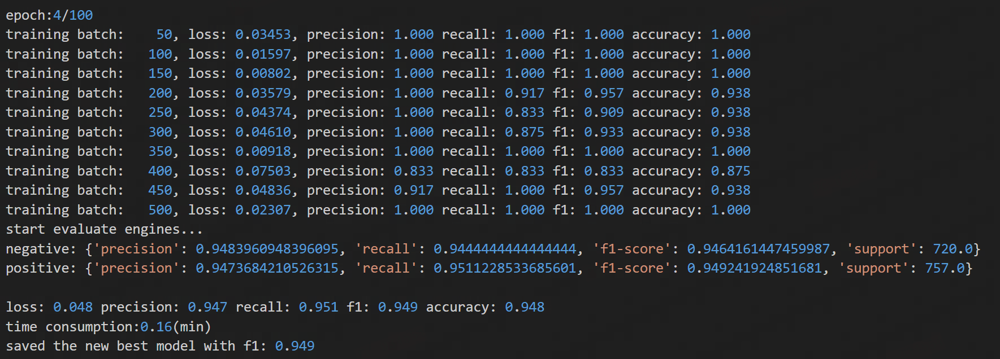
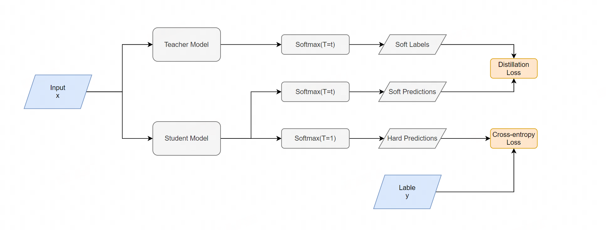
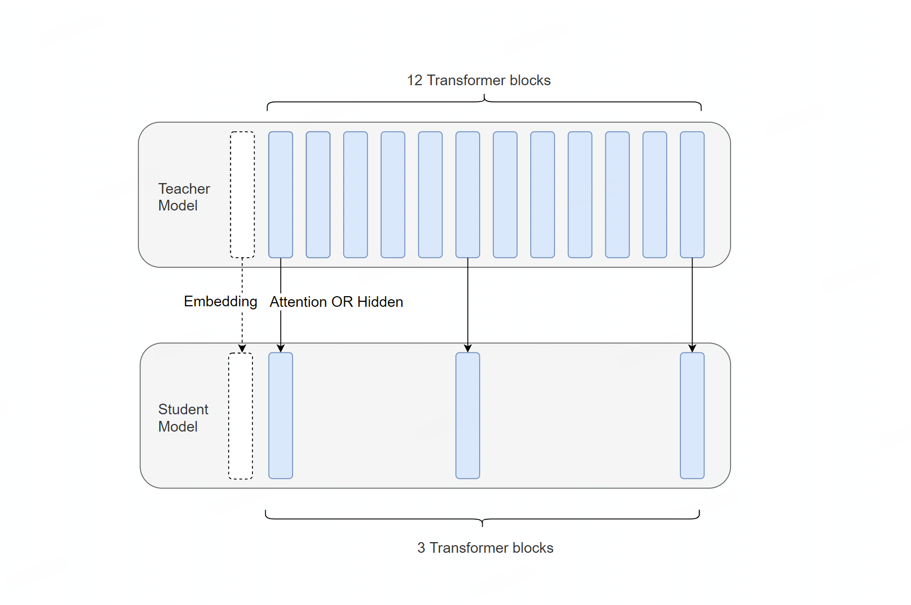
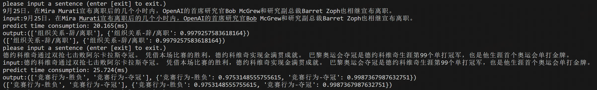
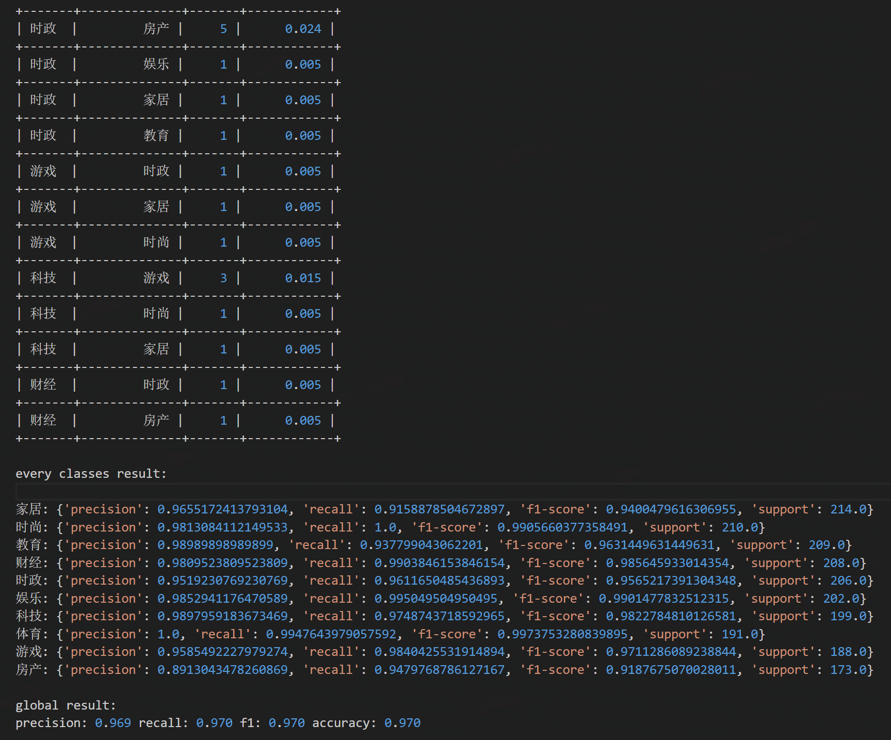

 [**English**](README.md) | [**中文说明**](README_ZH.md)


<p align="center">
    <br>
    
    <br>
</p>

<p align="center">
    <strong><span style="font-size: 50px;">Text Classification By Torch</span></strong>
</p>

<p align="center">
    <a>
        
    </a>
    <a>
        
    </a>    
    <a>
        
    </a>    
    <a>
        
    </a>
</p>


## Introduction
此仓库是基于Torch的文本分类任务，包含各种模型的训练Tricks、训练加速、蒸馏、压缩、剪枝技巧，支持单标签、多标签训练，更多更具体的训练方案可以在config.py文件中配置和发现。在LLM时代，文本分类的问题可以很好的被LLM解决，但是在某些场景下，传统的模型分类训练依旧被需要，比如高并发业务、低资源设备等，项目基本实现了前LLM时代分类的相关训练技巧并在文末整理了该项目用到的相关模型以及与训练有关的技巧的论文，方便使用者回顾。  

## Updates 
日期| 版本     |描述
:---|:-------|---
2023-12-01| v5.4.0 |增加对多标签文本分类的支持，引入多标签分类损失函数
2023-05-31| v5.3.0 |改为每个批次在训练时后置处理数据逻辑
2022-12-12| v5.2.0 |整合textpruner，增加模型剪枝方法，包含对词表的剪枝和对中间Transformer层的剪枝
2022-11-10| v5.1.1 |增加重要的对抗方式：FreeLB和AWP，并且重构对抗工具类，加入Noisytune方法
2022-10-21| v5.0.0 |整合textbrewer蒸馏工具进入该框架，加入自蒸馏，支持蒸馏小的预训练模型
2022-09-23| v4.0.2 |增加模型平均平滑方法EMA
2022-09-01| v4.0.1 |K-folds模型蒸馏到单模型
2022-08-31| v4.0.0 |增加K-folds，近一步利用验证集；蒸馏的训练合并到train逻辑，loss函数进行统一管理
2022-06-14| v3.9.2 |增加DeBertaV3模型支持
2022-05-23| v3.9.0 |增加label smoothing，缓解不同的打标人员带来的标准不一的情况
2022-04-24| v3.6.0 |增加multisample dropout
2022-04-21| v3.5.0 |加入进行随机权重平均swa方法、将train换成类的
2022-03-31| v3.4.0 |加入FastText、TextRCNN、MiniLM，可配置优化器，输出概率
2022-03-15| v3.3.0 |加入Transformer、XLNet、ALBert、RoBerta、Electra
2022-03-03| v3.1.0 |增加warmup进行训练，非微调模型参数初始化选项，支持fp16混合精度训练
2021-12-20| v3.0.0 |加各种tricks:rdrop、fgm、pgd、focalloss
2021-12-20| v2.2.0 |提供torch模型转ONNX方法
2021-09-23| v2.1.0 |没有提供验证集则自动生成验证集；增加测试数据集测试；预训练模型可配置可选择
2021-08-27| v2.0.0 |提供两种不同的蒸馏方法，详细参照论文
2021-08-10| v1.0.0 |初始仓库

## Requirement  
几个重要环境： 
* python：3.10+  
* torch：2.4.1+  
* 其它环境见`requirements.txt`

## Usage  
项目提供了多种模式，如下： 

Mode               |       Detail              | 
:------------------|---------------------------|
train_classifier   | 训练分类模型               |
interactive_predict| 交互预测模式               |
test               | 跑测试集                   |
convert_onnx       | 将torch模型保存onnx文件    |
show_model_info    | 打印模型参数               |

项目提供了对大小模型进行训练或者蒸馏减枝的方法： 

Mode               |       Detail              | 
:------------------|---------------------------|
finetune           | 微调预训练模型             |
train_small_model  | 单独训练小模型             |
distillation       | 模型蒸馏                   |
prune              | 模型剪枝                   |

项目支持的模型如下： 

Type               |       Detail                                                                          | 
:------------------|---------------------------------------------------------------------------------------|
Pretrained Models  | Bert、DistilBert、RoBerta、ALBert、XLNet、Electra、MiniLM、DeBertaV3、XLM-RoBERTa      |
Traditional Models | FastText、TextCNN、TextRNN、TextRCNN、Transformer                                      |

以上的模型类型需要在`config.py`中进行指定，`f_model_type`指定预训练模型，`s_model_type`指定小模型类型，你需要从stage里面指定对对应的模型进行操作。

### Train  
为了方便快速开始，项目中提供了三个样本数据集，分别对应以下的任务：     
DataSet            |       Task              | 
:------------------|-------------------------|
example1           | 二分类（情感分类）        |
example2           | 多分类（新闻分类）        |
example3           | 多标签分类               |  

你可以将对应的数据集下面的`config.py`文件替换项目的`config.py`，运行`main.py`即可开始训练。训练中会打印中间验证集结果：  
  
训练会保存优化器的参数，所以项目支持增量训练。训练集成了很多训练的技巧，部分是以前比赛提分的技巧。 

### Distill  
项目提供了多种蒸馏的方式，蒸馏的目的是通过让学生模型“复述”老师教授的知识，不丧失太多分类（此项目）能力的基础上，培养一个更加适合业务的、高并发的或端侧友好的学生模型，项目中提供了多种蒸馏方式。蒸馏的配置需要在`config.py`里面的`distill_configure`里面指定。  

* 跨模型蒸馏  

 
在`example_datasets2`下的`config.py`文件里面已经配置好了一个简单的跨模型蒸馏配置，目标是将训练好的Bert模型蒸馏到一个TextCNN模型，你只需要把令`stage = 'distillation'`，然后运行`main.py`即可开始进行蒸馏。  

蒸馏的模型同时也支持对测试集测试（设置`mode = 'test'`）和进行预测（设置`mode = 'interactive_predict'`）。  


* 预训练模型自蒸馏

  
预训练模型自蒸馏可以降低模型的Transformer Blocks的层数，如将一个12层的Bert-Base蒸馏到只有3层Transformer Blocks。这部分蒸馏的逻辑通过整合[TextBrewer](https://github.com/airaria/TextBrewer)来实现。依然使用`example_datasets2`下的`config.py`文件，需要把将`stage`修改为distillation，并且将`distill_configure`修改为以下配置，然后运行`main.py`即可开始进行蒸馏。

```
distill_configure = {
    'self_distillation': True,
    'distillation_method': 'mse',
    'teacher_model_type': 'Bert',
    'student_model_type': 'Bert',
    'checkpoints_dir': 'checkpoints/example2_distillation_1',
    'epoch': 100,
    'batch_size': 32,
    'learning_rate': 0.0001,
    'print_per_batch': 50,
    'is_early_stop': True,
    'patient': 2,
    'alpha': 0.1,
    'temperature': 4,
    'student_model_name': 'distillation_model.bin',
    'teacher_model_name': 'torch.bin',
    'distill_mlm_config': {
        'attention_probs_dropout_prob': 0.1,
        'hidden_act': 'gelu',
        'hidden_dropout_prob': 0.1,
        'hidden_size': 768,
        'initializer_range': 0.02,
        'intermediate_size': 3072,
        'max_position_embeddings': 512,
        'num_attention_heads': 12,
        'num_hidden_layers': 3,
        'type_vocab_size': 2,
        'vocab_size': 21128
    },
    'intermediate_matches': [
        {"layer_T": 0, "layer_S": 0, "feature": "hidden", "loss": "hidden_mse", "weight": 1},
        {"layer_T": 4, "layer_S": 1, "feature": "hidden", "loss": "hidden_mse", "weight": 1},
        {"layer_T": 8, "layer_S": 2, "feature": "hidden", "loss": "hidden_mse", "weight": 1},
        {"layer_T": 12, "layer_S": 3, "feature": "hidden", "loss": "hidden_mse", "weight": 1}
    ]
}
```
`distill_mlm_config`和`intermediate_matches`可以参考TextBrewer中给出的配置进行配置，支持对Transformer Block的hidden和多头注意力进行蒸馏。

* 多模型融合蒸馏

如果你使用K-Folds训练了K个模型，你可能想把五个模型融合成一个，本项目提供了模型融合蒸馏的方式，方法是将K个模型轮流对一个模型进行跨模型蒸馏。


### Interactive Predict  
模型训练完后，令`mode = 'interactive_predict'`可以快速试验一下模型的效果： 
  

* 当你打开K-Folds，本地会保留K个模型，预测的时候会对同一个样本输出的K个模型的logits取平均值（模型融合），然后再计算对应的分类。  
* 使用多标签分类的时候，会打印sigmoid(logits)中所有分数超过0.5的对应分类。  

### Test  
* 如果给定了测试数据集，令`mode = 'test'`可以试验模型在测试集的效果。不同的任务上测试的输出有一点差别，多分类（包含二分类）下，会输出每个类别下的指标，并且会输出一个badcase文件：  
  
* 当你打开K-Folds，测试的时候会对同一个样本输出的K个模型的logits取平均值，然后计算测试集效果。 
* 当使用多标签分类的时候，测试效果只会输出模型对所有标签的综合结果。  

## Reference  
* Framework  
[TextBrewer](https://github.com/airaria/TextBrewer)  
[TextPruner](https://github.com/airaria/TextPruner)    
* Distillation  
[Distilling Task-Specific Knowledge from BERT into Simple Neural Networks](https://arxiv.org/pdf/1903.12136)  
[Distilling the Knowledge in a Neural Network](https://arxiv.org/pdf/1503.02531)  
[DistilBERT, a distilled version of BERT: smaller, faster, cheaper and lighter](https://arxiv.org/pdf/1910.01108)  
[Patient Knowledge Distillation for BERT Model Compression](https://arxiv.org/pdf/1908.09355)  
[TinyBERT: Distilling BERT for Natural Language Understanding](https://arxiv.org/pdf/1909.10351)  
* Attack  
[Explaining and Harnessing Adversarial Examples](https://arxiv.org/pdf/1412.6572)  
[FreeLB: Enhanced Adversarial Training for Natural Language Understanding](https://arxiv.org/pdf/1909.11764)  
[Adversarial Weight Perturbation Helps Robust Generalization](https://arxiv.org/pdf/2004.05884)  
[Adversarial Training Methods for Semi-Supervised Text Classification](https://arxiv.org/pdf/1605.07725)  
[Towards Deep Learning Models Resistant to Adversarial Attacks](https://arxiv.org/pdf/1706.06083.pdf)  
* Loss Function  
[R-Drop: Regularized Dropout for Neural Networks](https://arxiv.org/pdf/2106.14448)  
[Focal Loss for Dense Object Detection](https://arxiv.org/pdf/1708.02002)
[PolyLoss: A Polynomial Expansion Perspective of Classification Loss Functions](https://arxiv.org/pdf/2204.12511)  
[ZLPR: A Novel Loss for Multi-label Classification](https://arxiv.org/abs/2208.02955)  
* Pretrained Models  
[BERT: Pre-training of Deep Bidirectional Transformers for Language Understanding](https://arxiv.org/pdf/1810.04805)  
[RoBERTa: A Robustly Optimized BERT Pretraining Approach](https://arxiv.org/abs/1907.11692)  
[ALBERT: A Lite BERT for Self-supervised Learning of Language Representations](https://arxiv.org/pdf/1909.11942)  
[XLNet: Generalized Autoregressive Pretraining for Language Understanding](https://arxiv.org/pdf/1906.08237)    
[ELECTRA (Efficiently Learning an Encoder that Classifies Token Replacements Accurately)](https://arxiv.org/pdf/2003.10555)  
[MiniLM: Deep Self-Attention Distillation for Task-Agnostic Compression of Pre-Trained Transformers](https://arxiv.org/pdf/2002.10957)   
[DeBERTaV3: Improving DeBERTa using ELECTRA-Style Pre-Training with Gradient-Disentangled Embedding Sharing](https://arxiv.org/pdf/2111.09543)   
[Unsupervised Cross-lingual Representation Learning at Scale](https://arxiv.org/pdf/1911.02116)   
* Traditional Models  
[Bag of Tricks for Efficient Text Classification](https://arxiv.org/pdf/1607.01759)  
[Convolutional Neural Networks for Sentence Classification](https://arxiv.org/pdf/1408.5882)  
[Recurrent Convolutional Neural Networks for Text Classification](https://cdn.aaai.org/ojs/9513/9513-13-13041-1-2-20201228.pdf)  
[Attention Is All You Need](https://arxiv.org/pdf/1706.03762)  
* Others  
[When Does Label Smoothing Help?](https://arxiv.org/pdf/1906.02629)  
[Multi-Sample Dropout for Accelerated Training and Better Generalization](https://arxiv.org/pdf/1905.09788)  
[Averaging Weights Leads to Wider Optima and Better Generalization](https://arxiv.org/pdf/1803.05407)   
[NoisyTune: A Little Noise Can Help You Finetune Pretrained Language Models Better](https://arxiv.org/pdf/2202.12024)  

## License 

该项目采用Apache 2.0 license开源许可证。 

## Citation

如果你在研究中使用了该项目，请按如下格式引用：

```latex
@misc{Text Classifier,
  title={Text Classifier: A tool for training text classifier using pytorch.},
  author={Shouxian Li},
  year={2024},
  howpublished={\url{https://github.com/stanleylsx/text_classifier_torch}},
}
